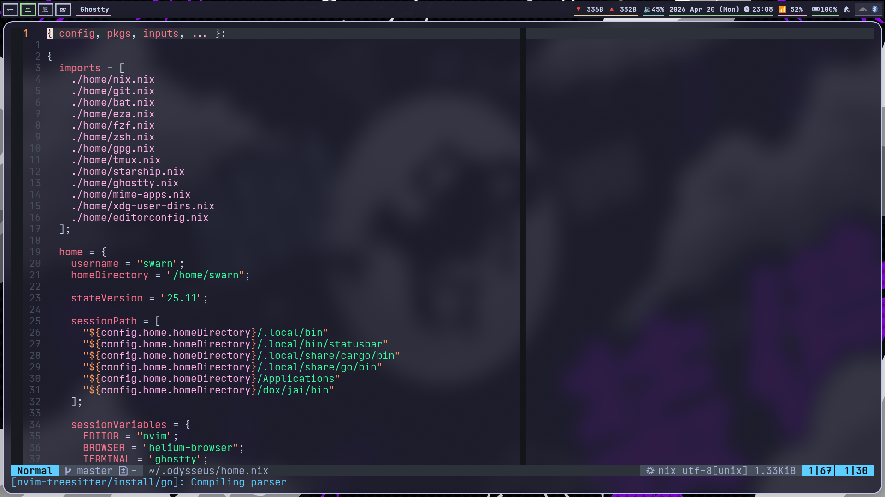

<h2 align="center">Odysseus</h2>

<p align="center">
    <a href="https://nixos.org/">
        </a>
    
    
    
  </a>
</p>

> "Nobody---that's my name. Nobody---so my mother and father call me, all my friends."

---



---

This is a nix home-manager managed dotfiles for my Arch Linux desktop.

This is a derivative of my other [dotfiles](https://github.com/demonkingswarn/dotfiles), where i only keep the configs for the programs which doesnt make sense to be managed by home-manager. This repo is specifically for my development environment configs. also my WM / Wayland Compositor configs are in that repo aswell as i dont wanna work on migrating those to here as they are too big for their own good.

Anyways, let me tell you why i used the name "Odysseus" for this repo. So Odysseus is the name of my desktop PC, and yes the computers in my house (including mobiles, and the homelab) are all themed around Greek Mythology, hence the name. Besides Odysseus is one of my favourite "real" Greek heroes, i used the term "real" here because Percy Jackson is my most favourite Greek hero.

---

## Installation

Make sure you have `home-manager` installed on your system.

```sh
git clone https://github.com/demonkingswarn/odysseus
cd odysseus
home-manager switch --flake .
```

If you are using this on a different distro than NixOS like me, then make sure to run this after `home-manager`:

```sh
nix profile install github:nix-community/nixGl
```
